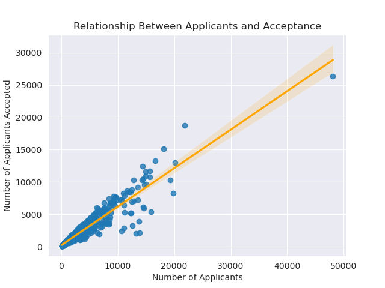
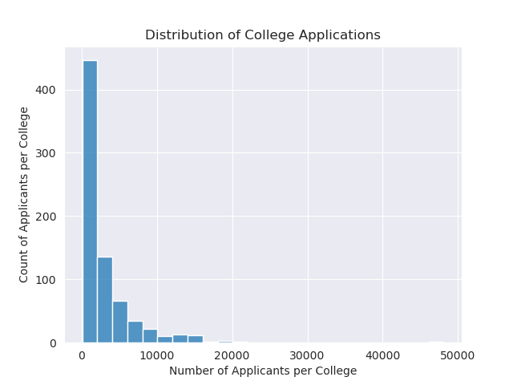

# College Applications
## Purpose
to come up with a way for colleges to be able to predict the amount of applicants that they would have based on some criteria
## Summary
### Data Cleaning
1. The Index column wasn't properly named, I changed it's name by using rename like so...
```python
df = df.rename({'Unnamed: 0' : 'University'}, axis = 1)
# rename changes the name from 'Unnamed: 0' to 'University'
# had to set axis to 1 to change the columns, and saved changes
``` 
2. Some columns had numeric values, I changed those two different ways...
```python
df['PhD'] = pd.to_numeric(df['PhD'],errors = 'coerce')
# This changed the small number of object values that the 'PhD' columns had
# to_numeric was the best option as they would be considered continous values

df['Private'] = df['Private'].replace({'Yes' : 1, 'No' : 0})
# This changed the object Values I had in 'Private' to be numeric
# This worked best for this column as it was a discreet value
```
3. I then dropped the remaining rows that had missing values
```python
df = df.dropna()
dropped null values and saved changes
```
### key visuals
#### 1. A heatmap of Correlations of In-State Tuition

**a heatmap which shows the correlations between different numerical columns (The one above is a condensed example, as the real one is too large), this was helpful when it came to selecting features in order to create the model**
#### 2. A Regression Line of Strength and cement (in KG)
 
**a regression plot which shows the relationship between the number of applicants and the number of applicants the school accepted. Important as they had a really strong correlation**
#### 3. A Regression Line of Strength and Water (in KG)
 
**a histogram that shows the distribution of ther number of applicants per college. Important as it shows us that the vast majority of colleges have less than 5000 applicants**
## Model Performance
### Feature Selection
I chose these features to be used in the production of my model
- Accept
- Enroll
- F.Undergrad
I chose them as they have strong correlations with the target and aren't actually affected by the target variable
### Model Selection
**I chose several models...**
1. Linear Regression
2. Decission Tree Regressor
3. Random Forest Regressor
**chose these because i'm used to using them**
### Evaluation Metrics
```
| Model                   | R²     |
|-------------------------|--------|
|Linear Regressor         |91.942 %|
|Decission Tree Regressor |73.051 %|
|Random Forest Regressor  |70.536 %|
```
### pickling
I chose to pickle the Linear Regression model as it had the best R squared score by far.
## conclusion
#### my analysis was able to create a model that is effecctive at developing predictions, it could be used to...
- Predict the number of applicants for every school